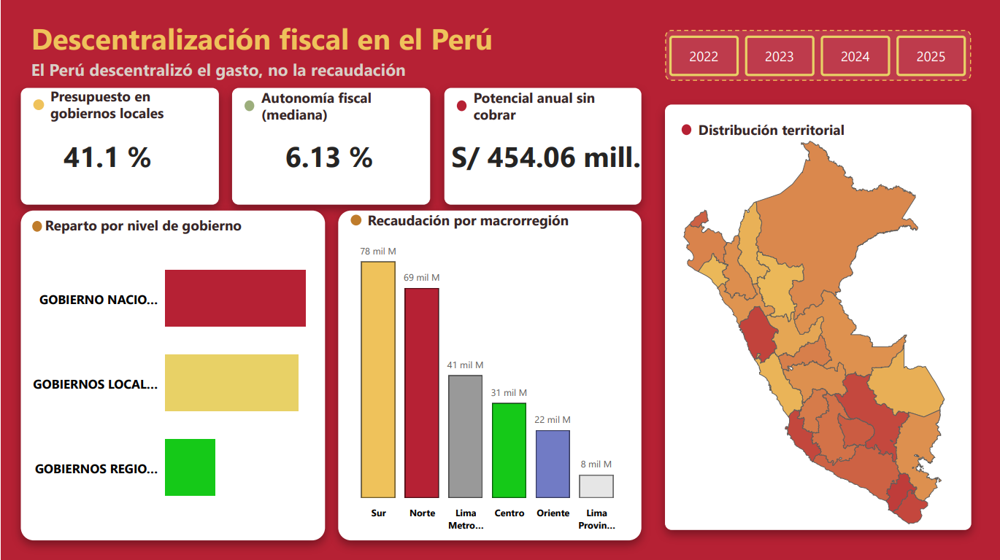
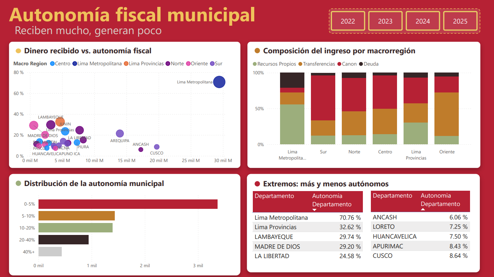
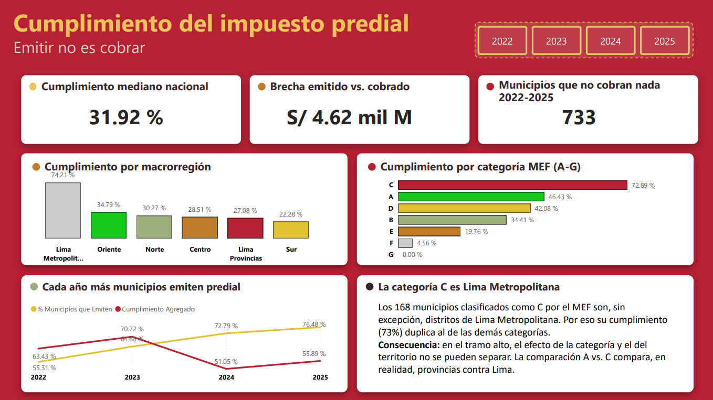
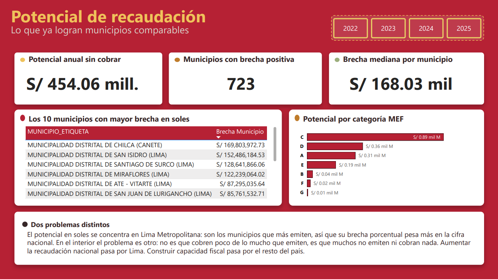
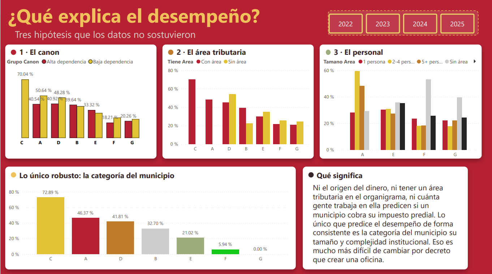

# Descentralización fiscal en el Perú: ¿cuánto dinero manejan realmente las municipalidades?

**No en la ley, sino en el dinero.** Los gobiernos locales del Perú
administran el 41% del presupuesto público. Pero de cada 100 soles que
maneja la municipalidad típica, apenas 6 los generó ella misma.

Este proyecto cruza tres fuentes públicas del MEF y el INEI para medir esa
brecha entre administrar recursos y ser capaz de generarlos, en las 1,890
municipalidades del país entre 2022 y 2025.

> **In brief (EN):** An end-to-end data pipeline analyzing fiscal
> decentralization in Peru. It combines three public datasets from the
> Ministry of Economy (MEF) and the National Statistics Institute (INEI)
> to measure how much revenue each of Peru's 1,890 municipalities
> generates on its own versus how much depends on central government
> transfers, from 2022 to 2025. Built with Python, SQL Server and
> Power BI following a Medallion architecture.

## Las preguntas

El proyecto está construido para responder seis preguntas concretas, cada
una traducida en un dashboard de decisión:

1. **¿Cómo se reparte el dinero público en el territorio?**
   Concentración del presupuesto y la recaudación entre Lima Metropolitana,
   Lima Provincias y las macrorregiones del país (Norte, Centro, Sur,
   Oriente), incluyendo el corte entre gobiernos locales y regionales.

2. **¿Qué tan autónomas son las municipalidades fuera de Lima?**
   Proporción de ingresos que cada municipalidad genera por sí misma
   (recursos directamente recaudados e impuestos municipales) frente a los
   que recibe por transferencias del gobierno central.

3. **¿Quién cumple mejor su meta de impuesto predial?**
   Comparación del cumplimiento entre Lima y las regiones, usando los datos
   del Programa de Incentivos del MEF.

4. **¿El cumplimiento depende de la categoría asignada por el MEF?**
   Las metas del Programa de Incentivos no las define cada municipalidad:
   el MEF las asigna según su clasificación. La pregunta es si esa
   categorización explica las diferencias de desempeño.

5. **¿Cuánto potencial de recaudación queda sin aprovechar?**
   Escenarios de "¿qué pasaría si...?" comparando cada municipalidad contra
   el desempeño de sus pares con características similares.

6. **¿Qué tienen en común las municipalidades que recaudan mejor?**
   Cruce entre estructura municipal (personal, instrumentos de gestión,
   área de administración tributaria) y cumplimiento de la meta predial.

## Alcance

Este proyecto mide la descentralización desde su dimensión
**fiscal-administrativa**: la capacidad de las municipalidades para generar
y gestionar sus propios recursos. No aborda la dimensión política de la
descentralización, que requiere fuentes distintas.

## Hallazgos

**El Perú descentralizó el gasto, no la recaudación.** Los gobiernos
locales administran el 41% del presupuesto público (los regionales, 16%;
el nacional, 43%). Sin embargo, la mediana de autonomía fiscal municipal
es de **6.1%**: la municipalidad típica genera por sí misma seis de cada
cien soles que administra. El promedio (11.8%) duplica a la mediana, señal
de que unos pocos distritos con alta recaudación propia elevan la cifra
general.

**El dinero no llega donde más se gestiona, sino donde hay minas.** El Sur
concentra el 31.4% de los recursos subnacionales —más que ninguna otra
macrorregión— pero el 65% de lo que recaudan sus gobiernos locales es
canon: les corresponde por su geología, no por su gestión. En los
gobiernos locales de Lima Metropolitana el canon representa apenas el 8%.

**La brecha no es capital contra provincias, es metropolitano contra todo
lo demás.** Lima Metropolitana tiene una mediana de cumplimiento predial
de 74%. Lima Provincias —el mismo departamento— cae a 27%, por debajo del
Norte (30%) y del Oriente (35%). Separar ambas realidades fue una decisión
de diseño temprana del proyecto; los datos la confirmaron.

**En el tramo bajo, la administración tributaria simplemente no existe.**
En 2022, ninguno de los 143 municipios de categoría G emitió impuesto
predial. En 2024, de los 98 que sí emitieron, 74 (75%) no cobraron ni un
sol de lo emitido. La mediana de cumplimiento de esa categoría es 0%.

**S/ 454 millones al año quedan sin cobrar.** Si cada municipalidad
alcanzara el cumplimiento del mejor 25% de sus pares —no un ideal
teórico, sino lo que municipios comparables ya logran— la recaudación
predial del país crecería en ese monto anual. La cifra baja de una
primera estimación de S/ 464 millones tras excluir también los casos de
emisión implausible detectados en el diagnóstico de calidad de datos. El
mayor caso individual es San Isidro en 2025, con S/ 57.1M en un solo
año.

**El cumplimiento se desplomó justo cuando más municipios empezaron a
reportar.** Entre 2022 y 2025, la proporción de municipios que emiten
impuesto predial subió de 55% a 76%. Pero el cumplimiento agregado
nacional cayó de 70.6% en 2023 a 51.2% en 2024, y no se recuperó del
todo en 2025. La causa no es que los municipios dejaran de cobrar: es
que 259 municipios reportaron emisión sin registrar ni un sol de
recaudación en 2024, contra solo 35 el año anterior. Los datos
disponibles no permiten distinguir una caída real de cobranza de un
cambio en el registro del MEF —los indicadores de cumplimiento de 2024
y 2025 deben leerse con esa salvedad.

### Tres hipótesis que los datos no sostuvieron

**El canon no explica la baja cobranza.** En agregado, los municipios con
alta dependencia del canon cumplen peor (33% contra 39%). Pero al
controlar por categoría, el efecto se disuelve y cambia de dirección según
el grupo: era composición, no causa. Los municipios con mucho canon tienden
a ser pequeños, y el tamaño es lo que explica la diferencia.

**Tener un área de administración tributaria no basta.** Entre los
municipios con cobranza baja y los de cobranza aceptable, la proporción
que declara tener área tributaria es prácticamente la misma (93% y 92%).
Controlando por categoría, el efecto se invierte en los tramos E, F y G.

**Dotarla de personal tampoco resulta determinante.** Ni el personal
absoluto del área ni su proporción sobre la planilla total sostienen un
patrón consistente al controlar por categoría. Una interpretación
plausible —no demostrable con estos datos— es causalidad inversa: los
municipios con problemas de cobranza son los que crean el área, no al
revés.

**Lo que sí queda en pie:** la categoría del municipio es la única
variable que predice el desempeño de forma robusta y consistente. Las
variables de estructura interna disponibles no agregan poder explicativo
una vez controlado ese factor.

## Dashboards

Cinco páginas en Power BI, cada una respondiendo una de las preguntas del
proyecto. El archivo completo está en
[`Power BI/Dashboard Final.pbix`](<Power BI/Dashboard Final.pbix>).

### 1. Panorama

Vista general: presupuesto por nivel de gobierno, autonomía fiscal
mediana, potencial de recaudación sin cobrar, recaudación por
macrorregión y su distribución en el mapa del país.

### 2. Autonomía fiscal municipal

Cuánto recibe cada macrorregión frente a cuánto genera por sí misma, la
composición del ingreso (recursos propios, transferencias, canon,
deuda), y los departamentos más y menos autónomos del país.

### 3. Cumplimiento del impuesto predial

Cumplimiento mediano nacional, la brecha entre lo emitido y lo cobrado,
el cumplimiento por macrorregión y por categoría MEF, y la evolución
2022-2025 que muestra el quiebre de 2024.

### 4. Potencial de recaudación

Cuánto más podría recaudar cada municipalidad si igualara a sus pares,
los diez casos con mayor brecha en soles, y por qué el problema tiene
una cara distinta en Lima que en el resto del país.

> Nota: el "S/ 57.1M" de San Isidro citado en Hallazgos es la brecha de
> un solo año (2025) contra el percentil 75 de su categoría. El ranking
> de este dashboard acumula los cuatro años por municipio, por eso ahí
> San Isidro aparece con S/ 152.5M — son dos cortes distintos del mismo
> dato, no una inconsistencia.

### 5. ¿Qué explica el desempeño?

Las tres hipótesis puestas a prueba (canon, área tributaria, personal) y
por qué ninguna predice el cumplimiento tan bien como la categoría del
municipio.

## Los datos

Tres fuentes públicas, unidas por el **UBIGEO** (el código único que
identifica a cada distrito del Perú).

### 1. Presupuesto y Ejecución de Ingreso — MEF
[datosabiertos.mef.gob.pe](https://datosabiertos.mef.gob.pe/dataset/presupuesto-y-ejecucion-de-ingreso)

Ejecución presupuestal de ingresos por entidad. Aporta el presupuesto
inicial (PIA), el modificado (PIM) y lo efectivamente recaudado,
desagregado por rubro —que es lo que permite distinguir recursos propios
de transferencias.

**Cobertura:** 2022–2025 · **Volumen:** 2.7 millones de registros

### 2. Seguimiento de la Meta del Impuesto Predial — MEF
[datosabiertos.mef.gob.pe](https://datosabiertos.mef.gob.pe/dataset/seguimiento-de-la-meta-del-impuesto-predial)

Información que las municipalidades reportan al Programa de Incentivos a
la Mejora de la Gestión Municipal sobre su emisión y recaudación de
impuesto predial, más la clasificación que el MEF asigna a cada una.

**Cobertura:** 2022–2025 · **Volumen:** ~1,000 municipalidades por año

### 3. Registro Nacional de Municipalidades (RENAMU) — INEI
[datosabiertos.gob.pe](https://www.datosabiertos.gob.pe/dataset/registro-nacional-de-municipalidades-renamu-2025-instituto-nacional-de-estad%C3%ADstica-e)

Censo anual a todas las municipalidades del país. Aporta la estructura
institucional: personal por régimen laboral, instrumentos de gestión,
existencia de un área de administración tributaria.

**Cobertura:** 2022–2025 · **Volumen:** ~1,890 municipalidades por año

---

### Sobre la cobertura

Las tres fuentes conectan por UBIGEO, pero no cubren el mismo universo.
RENAMU e Ingreso incluyen la totalidad de municipalidades provinciales y
distritales del país; la fuente de meta predial cubre alrededor de la
mitad, ya que solo registra a las municipalidades que reportaron al
Programa de Incentivos. Los análisis de cumplimiento predial se leen sobre
ese subconjunto, no sobre el total nacional.

## Arquitectura

El proyecto sigue una **arquitectura Medallion**, que separa los datos en
tres capas según su nivel de procesamiento:

| | Bronze | Silver | Gold | |
|---|---|---|---|---|
| **Fuentes** → | Archivos crudos, sin tocar | → Datos limpios en Parquet | → Tablas analíticas en SQL Server | → **Power BI** |
| MEF (2), INEI (1) | `requests` | `pandas` | `T-SQL` | Dashboards |

| Capa | Qué contiene | Herramienta |
|------|--------------|-------------|
| **Bronze** | Los archivos tal como se descargaron. Nunca se modifican. | Python (`requests`) |
| **Silver** | Datos limpios, tipados y validados. Una tabla por fuente. | Python + pandas → Parquet |
| **Gold** | Tablas agregadas y cruzadas, listas para consumo. | SQL Server (T-SQL) |
| **Visualización** | Dashboards de decisión. | Power BI |

**Por qué este reparto:** la limpieza de Silver (encodings distintos por
fuente, construcción del UBIGEO, recorte de más de 1,300 columnas en
RENAMU) es más natural en pandas; los cruces entre fuentes y las
agregaciones analíticas de Gold son más naturales en SQL. Cada herramienta
en la capa donde rinde mejor.

Bronze se mantiene intacto por diseño: si una regla de negocio cambia,
Silver y Gold se reconstruyen desde el dato original sin volver a
descargar nada.

## Hallazgos en la calidad de los datos

Trabajar con datos públicos peruanos implica encontrarse con
inconsistencias que no están documentadas en ninguna parte. Estos son los
problemas que se detectaron y cómo se resolvieron:

**La misma métrica reportada en formularios distintos.** En la fuente de
meta predial, el monto de emisión de una municipalidad podía aparecer en
más de un formulario dentro del mismo año, y una agregación directa lo
sumaba dos veces. En el caso de San Isidro, la emisión de 2025 saltaba a
S/ 242 millones cuando el valor real era S/ 121 millones. Además, el
identificador de formulario cambia entre rondas del programa, así que no
se podía fijar por número: la regla implementada toma, para cada columna,
el valor de la ronda más reciente que lo reporte, sin sumar entre
formularios.

**Errores de escala en la fuente.** Algunas municipalidades reportan la
misma cifra con una magnitud mil veces menor según la ronda (una emisión
de S/ 1,188,552 aparece como S/ 1,188.55 al año siguiente). Como el monto
de emisión es el denominador del indicador de cumplimiento, estos casos
generaban ratios imposibles. No se corrigen ni se eliminan: se marcan con
banderas (`FLAG_EMISION_SOSPECHOSA`, `FLAG_CUMPLIMIENTO_ATIPICO`) para que
cada análisis decida si incluirlos.

**Totales mezclados con detalle.** El campo de mes en la fuente predial
incluye los doce meses del año y, además, un valor 13 que corresponde al
total anual. Sumar sin filtrar duplicaba todos los montos.

**Variables que dejaron de recolectarse.** El número de predios y de
contribuyentes existe en la fuente solo hasta 2019. RENAMU tampoco lo
registra. En consecuencia, no es posible normalizar la recaudación por
número de predios en el período analizado.

**Catálogos que se contaminan entre sí.** Parte de la información de
arbitrios municipales —un tributo distinto al predial— aparece bajo los
mismos identificadores de formulario. El filtro por título no era una
solución general: la recaudación real de San Isidro en 2024-2025 está
catalogada, por error de la fuente, como "arbitrios". El criterio final
usa el título solo para desempatar cuando dos registros compiten, nunca
como filtro.

Todas las decisiones de tratamiento están documentadas con su
justificación en [`Docs/reglas-de-negocio.md`](Docs/reglas-de-negocio.md).

## Cómo ejecutar el proyecto

**Requisitos:** Python 3.10+ y SQL Server (para la capa Gold).

```bash
# 1. Clonar el repositorio
git clone https://github.com/Klismann21/proyecto-descentralizacion-peru.git
cd proyecto-descentralizacion-peru

# 2. Instalar dependencias
pip install -r requirements.txt

# 3. Descargar las fuentes a la capa Bronze
python Src/ingesta/descargar_bronze.py

# 4. Construir la capa Silver (una fuente a la vez)
python Src/silver/construir_ingreso.py
python Src/silver/construir_meta_predial.py
python Src/silver/construir_renamu.py

# 5. Crear la base de datos y las tablas Silver en SQL Server
python Src/gold/cargar_silver.py --setup

# 6. Cargar los Parquet de Silver a SQL Server
python Src/gold/cargar_silver.py

# 7. Crear los objetos de la capa Gold
#    Ejecutar en SSMS, en orden, los scripts de SQL/gold/
#    y luego los procedures (EXEC gold.sp_cargar_autonomia_fiscal, etc.)

# 8. Cargar la tabla de contexto por nivel de gobierno
python Src/gold/cargar_reparto_nivel_gobierno.py
```

Cada script de Silver imprime en consola sus reportes de validación
(cobertura por año, integridad del UBIGEO, valores atípicos) antes de
escribir el Parquet. Las validaciones reportan, no corrigen ni descartan
filas automáticamente.

**Nota sobre los datos:** los archivos de Bronze y Silver no se versionan
en el repositorio por su tamaño. Se regeneran ejecutando los scripts
anteriores, que descargan directamente desde las fuentes oficiales.

## Estructura del repositorio

```
├── Src/
│   ├── ingesta/          # Descarga de fuentes → Bronze
│   ├── silver/           # Limpieza y validación → Silver
│   └── gold/             # Carga a SQL Server y conexión
├── SQL/                  # Transformaciones Silver → Gold
├── Data/
│   ├── bronze/           # Archivos crudos (no versionado)
│   └── silver/           # Parquet limpios (no versionado)
├── Docs/
│   ├── diccionarios/     # Diccionarios de datos de las fuentes
│   ├── imagenes/         # Capturas de los dashboards
│   ├── reglas-de-negocio.md
│   └── diagnostico-calidad-gold.md
├── Power BI/             # Dashboard (.pbix)
└── README.md
```

No hay carpeta `Data/gold/`: la capa Gold no se guarda en archivos, vive
directamente en SQL Server (base `GoldFiscal`, esquema `gold`) — ver
"Arquitectura" más arriba.
